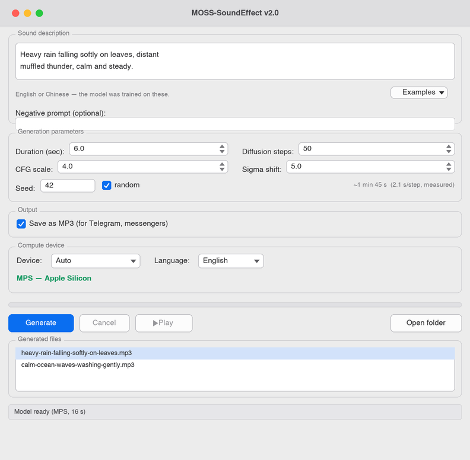

# MOSS-SoundEffect v2.0 — desktop app for AMD ROCm and Apple Silicon

A small, dependency-light desktop front-end for
[MOSS-SoundEffect-v2.0](https://huggingface.co/OpenMOSS-Team/MOSS-SoundEffect-v2.0),
the text-to-audio diffusion model from the OpenMOSS team. Type a description,
get a sound effect. Everything runs locally — no API keys, no uploads.

The upstream project ships CUDA-oriented scripts and a Gradio demo. This
repository adds what was missing for the hardware I actually use: a native
Tkinter window, a working **AMD ROCm** path on Windows, and a working
**Apple Silicon (MPS)** path on macOS, plus the fixes needed to get to both.
See [Platform support](#platform-support).



---

## Features

- **Native window, no browser.** Tkinter only — no Gradio, no local web server.
- **Model stays loaded.** Weights load once in a background thread; the second
  generation starts instantly instead of paying the ~60 s load again.
- **Live progress and ETA.** Per-step timing measured on your machine, not
  guessed. Generation can be cancelled between steps.
- **Trilingual UI** — English, Russian, Chinese; auto-detected on first run.
- **MP3 or WAV output**, named after the prompt, with peak limiting tuned per
  format so MP3 encoding does not clip.
- **Device switching at runtime** — Auto / GPU / CPU, without restarting.
- **CLI and benchmark scripts** for scripted generation and hardware testing.
- **MCP server** — expose generation to Claude Desktop, Claude Code and other
  MCP clients as a tool. See [Use as an MCP server](#use-as-an-mcp-server).

## Platform support

| Platform | Backend | Status |
|---|---|---|
| Windows + AMD Radeon (ROCm) | `cuda` (ROCm build) | Tested — primary development target |
| Windows / Linux + NVIDIA | `cuda` | Should work; untested |
| macOS + Apple Silicon | `mps` | Tested — see [MPS notes](#mps-notes) |
| Any | `cpu` | Tested (slow — see [Performance](#performance)) |

Developed on an AMD Radeon 8060S (Strix Halo, `gfx1151`) under Windows 11 and
verified on an Apple M4 Pro (macOS 26, `bfloat16`), both on Python 3.12.

---

## Install

### Requirements

- **Python 3.12** — required by the upstream package. Other versions will fail
  to resolve dependencies.
- **git** — the model pipeline is installed straight from a GitHub commit.
- **~13 GB free disk** — 11 GB of weights plus the PyTorch/dependency stack.
- **RAM/VRAM:** the 1.3B model needs roughly 8–10 GB. On Apple Silicon this
  comes out of unified memory, so 16 GB is comfortable and 8 GB is tight.
- **Platform toolchain:**
  - *macOS:* Apple Silicon (M1 or newer) and **macOS 14+** for stable
    `bfloat16` on MPS. A Python with working Tcl/Tk — see the note below.
  - *Windows + AMD:* Adrenalin driver **26.2.2 or newer** for the ROCm wheels.

The whole thing runs offline after the weights are downloaded — no API keys,
no account, nothing is uploaded.

### 1. Clone and create a virtual environment

Python **3.12** is required by the upstream package.

```bash
git clone https://github.com/VladimirTalyzin/MOSS-SoundEffect_v2.0_MPS_ROCm.git
cd MOSS-SoundEffect_v2.0_MPS_ROCm
python -m venv venv
```

Activate it: `venv\Scripts\activate` (Windows) or `source venv/bin/activate`
(macOS/Linux).

> **macOS:** the desktop app uses Tkinter, which needs a Python built with a
> working Tcl/Tk. The python.org installer and Homebrew's
> `python-tk@3.12` both provide it; the standalone builds used by `pyenv` and
> `uv` often do **not** (`import tkinter` succeeds but `tk.Tk()` fails with
> *"Can't find a usable init.tcl"*). The CLI (`generate.py`, `benchmark.py`)
> has no such requirement. With Homebrew:
> `brew install python@3.12 python-tk@3.12`.

### 2. Install PyTorch for your hardware

This has to come first and separately — the wheels are platform-specific.

**AMD ROCm on Windows** (needs Adrenalin driver 26.2.2 or newer):

```bash
pip install -f https://repo.radeon.com/rocm/windows/rocm-rel-7.2.1/ \
    "torch==2.9.1+rocm7.2.1" "torchaudio==2.9.1+rocm7.2.1"
```

**AMD ROCm on Linux:**

```bash
pip install --index-url https://download.pytorch.org/whl/rocm6.2 torch torchaudio
```

**Apple Silicon** — the default macOS wheels include MPS:

```bash
pip install torch torchaudio
```

**NVIDIA CUDA:**

```bash
pip install --index-url https://download.pytorch.org/whl/cu128 torch torchaudio
```

**CPU only:**

```bash
pip install --index-url https://download.pytorch.org/whl/cpu torch torchaudio
```

### 3. Install the rest

```bash
pip install -r requirements.txt
```

This pulls the `moss_soundeffect_v2` package straight from the upstream
repository, pinned to the commit this app was built against. The upstream
checkout lands in `src/` (pip's default for editable VCS installs) and is
git-ignored here.

### 4. Download the weights (~11 GB)

```bash
python download_model.py
```

Files go to `models/MOSS-SoundEffect-v2.0/`, which is also git-ignored. The
download resumes if interrupted; to speed it up, `pip install hf_transfer` and
set `HF_HUB_ENABLE_HF_TRANSFER=1` before running.

### 5. Verify it works

`benchmark.py` loads the model, runs a few steps, and checks the output for
NaN/silence — the fastest way to confirm your GPU path is healthy:

```bash
python benchmark.py --steps 10 --seconds 3
```

You want `nan/inf: False` and a non-zero `audio peak`. On an M4 Pro this prints
about `2.1 s/step` on `mps`; anything with `nan/inf: True` means the dtype is
wrong for your hardware (see [ROCm notes](#rocm-notes) / [MPS notes](#mps-notes)).

---

## macOS quick start (Apple Silicon)

The whole sequence in one place, using Homebrew's Tk-capable Python:

```bash
brew install python@3.12 python-tk@3.12
git clone https://github.com/VladimirTalyzin/MOSS-SoundEffect_v2.0_MPS_ROCm.git
cd MOSS-SoundEffect_v2.0_MPS_ROCm
/opt/homebrew/bin/python3.12 -m venv venv
source venv/bin/activate
pip install torch torchaudio          # default macOS wheels include MPS
pip install -r requirements.txt
python download_model.py              # ~11 GB, one time
python benchmark.py --steps 10        # sanity check → nan/inf: False
python app.py                         # launch the desktop app
```

---

## Usage

### Desktop app

Windows: double-click **`MOSS SoundEffect.bat`**.
macOS: `chmod +x "MOSS SoundEffect.command"` once, then double-click it.
Or just run it directly:

```bash
python app.py
```

Prompts work in **English or Chinese** — those are the languages the model was
trained on. The UI language is separate and includes Russian.

Generated files land in `outputs/`, named after the prompt.

### Command line

```bash
python generate.py "A dog barking loudly in a park." out.wav --seconds 5 --steps 50
```

| Option | Default | Meaning |
|---|---|---|
| `--seconds` | `5.0` | Length of the clip (model maximum: 30) |
| `--steps` | `50` | Diffusion steps — more is slower and usually cleaner |
| `--cfg` | `4.0` | Prompt adherence; higher follows the text more literally |
| `--seed` | random | Fix it to reproduce a result exactly |

### Benchmark

Measures seconds per step and checks the output for NaN/silence, which catches
the "fast but garbage" failure mode described below.

```bash
python benchmark.py --steps 30
python benchmark.py --steps 30 --device cpu       # compare against CPU
python benchmark.py --steps 30 --dtype float16    # see it break on ROCm
```

### Environment variables

| Variable | Default | Effect |
|---|---|---|
| `MOSS_DEVICE` | `auto` | Force `cuda`, `mps` or `cpu` (CLI scripts and MCP server) |
| `MOSS_DTYPE` | auto | Force a dtype, e.g. `float32`. Overrides the safe default |
| `MOSS_CPU_VAE` | `1` on ROCm, else `0` | Run the VAE decoder on CPU (see below) |
| `TORCH_ROCM_AOTRITON_ENABLE_EXPERIMENTAL` | `1` | Hardware SDPA on ROCm — big speedup |

---

## Use as an MCP server

[`mcp_server.py`](mcp_server.py) exposes generation over the
[Model Context Protocol](https://modelcontextprotocol.io), so any MCP client —
Claude Desktop, Claude Code, Cursor, Cline — can create sound effects by
calling a tool. It reuses the same pipeline, device/dtype selection and
ROCm/MPS fixes as the CLI, so everything on this page (`bfloat16` on GPU,
CPU-VAE on ROCm, the `MOSS_*` environment variables) applies unchanged.

The model (~11 GB) loads **lazily on the first tool call**, not at server
startup, and then stays resident — so the first effect is slow and the rest are
fast, exactly like the desktop app.

### 1. Install the MCP SDK

One extra dependency, on top of the normal [install](#install):

```bash
pip install "mcp[cli]"
```

### 2. Register the server with your client

**Claude Desktop / Claude Code** — add this to the MCP config
(`claude_desktop_config.json`, or `claude mcp add-json`), using **absolute
paths** to the venv's Python and to `mcp_server.py`:

```json
{
  "mcpServers": {
    "moss-soundeffect": {
      "command": "/absolute/path/to/MOSS-SoundEffect_v2.0_MPS_ROCm/venv/bin/python",
      "args": ["/absolute/path/to/MOSS-SoundEffect_v2.0_MPS_ROCm/mcp_server.py"],
      "env": {
        "MOSS_DEVICE": "auto"
      }
    }
  }
}
```

On Windows the `command` is `...\venv\Scripts\python.exe`. The `env` block is
optional — add `MOSS_DTYPE`, `MOSS_CPU_VAE`, etc. from the table above to
override the auto-detected defaults.

With Claude Code you can register it in one line:

```bash
claude mcp add moss-soundeffect -- /absolute/path/to/venv/bin/python /absolute/path/to/mcp_server.py
```

### 3. Use it

Restart the client and ask it, in plain language, for a sound —
*"generate a 5-second sound of a heavy door creaking open"*. The client calls
the tool; the finished file lands in `outputs/`, named after the prompt, and
the tool returns its path.

### The tool

| Tool | `generate_sound_effect` |
|---|---|
| `prompt` | Text description of the sound (English or Chinese — the model's training languages) |
| `seconds` | Clip length, `0 < seconds <= 30` (default `5.0`) |
| `steps` | Diffusion steps (default `50`) |
| `cfg` | Prompt adherence (default `4.0`) |
| `seed` | Fix for a reproducible result (default random) |
| `format` | `"wav"` or `"mp3"` (default `"wav"`) |

It returns the output path, the parameters used, and the generation time.

### Running it directly

To try the server without a client — e.g. with the MCP Inspector — run it by
hand. Default transport is stdio; set `MOSS_MCP_TRANSPORT=sse` for HTTP/SSE:

```bash
python mcp_server.py                 # stdio
mcp dev mcp_server.py                # stdio + web Inspector
MOSS_MCP_TRANSPORT=sse python mcp_server.py   # HTTP/SSE on :8000
```

---

## Performance

Measured on AMD Radeon 8060S (Strix Halo, `gfx1151`), Windows 11, ROCm 7.2.1,
`bfloat16`, VAE on CPU:

| Configuration | Seconds per diffusion step |
|---|---|
| CPU (float32) | 4.15 |
| GPU, no AOTriton flag | 1.24 |
| GPU, AOTriton enabled | **0.54** |

That is a 7.6× speedup over CPU, and 2.3× of it comes from a single
environment variable.

---

## ROCm notes

Four things had to be worked out experimentally to get this model running on
`gfx1151`. All of them are handled automatically by the code; this section is
here so the reasoning is not lost.

**1. Use `bfloat16`, not `float16`.** `float16` overflows and produces NaN
non-deterministically — output is silence or noise, with no error raised. This
contradicts the common advice to prefer fp16 on Windows/gfx1151; for this model
the opposite holds. `bfloat16` and `float32` are both stable. This is why
`benchmark.py` prints peak/RMS/NaN stats instead of just timings: on this
hardware you have to check the audio, not just that the process exited zero.

**2. `TORCH_ROCM_AOTRITON_ENABLE_EXPERIMENTAL=1` is worth 2.3×.** Without it,
scaled dot-product attention silently falls back to the slow math path
(1.24 → 0.54 s/step). Both `app.py` and the CLI scripts set it on import; the
variable is ignored on CPU and NVIDIA.

**3. `torch.distributed` is stripped from the ROCm Windows build.**
`descript-audiotools` touches `dist.ReduceOp.AVG` at module level, so the
import fails before any weights are loaded. [`rocm_compat.py`](rocm_compat.py)
installs the handful of missing names — single-process inference never needs
the real thing.

**4. The VAE runs faster on CPU than on GPU.** MIOpen falls back to a generic
solver for the DAC decoder's convolutions, making GPU decode roughly 20×
slower than CPU, and leaving the weights in a dtype that can overflow. Since
decode happens once per generation, [`rocm_compat.use_cpu_vae()`](rocm_compat.py)
keeps the DiT on the GPU and moves just the VAE to CPU/float32. Enabled by
default on ROCm only; set `MOSS_CPU_VAE=1` to try it elsewhere.

---

## MPS notes

Apple's Metal backend is stricter about numeric types than CUDA, so two things
had to be worked out to get this model running on Apple Silicon. Both are
handled automatically by [`mps_compat.py`](mps_compat.py); this section records
why.

**1. RoPE frequency buffers are `complex128`; MPS has no `float64`.** The DiT
registers its rotary-embedding tables (`freqs_cis_*`) as `complex128` — a pair
of `float64` values. Moving the model to `mps` therefore fails outright with
*"Cannot convert a MPS Tensor to float64 dtype"*, before a single step runs.
The attention code only ever reads `freqs.real` / `freqs.imag` (cosines and
sines in `[-1, 1]`) and does no complex arithmetic, so the pipeline is loaded on
CPU, its `float64`/`complex128` tensors are narrowed to `float32`/`complex64`,
and only then moved to the GPU.

**2. The timestep embedding is computed in `float64`.** `sinusoidal_embedding_1d`
hard-casts to `float64` on every denoising step. That is fine on CUDA but fatal
on MPS, so a `float32` equivalent is patched in for the MPS path only — the
positions involved are small and `float32` is more than precise enough. CUDA and
ROCm keep the original `float64` version untouched.

Unlike ROCm, the VAE decoder runs cleanly in `bfloat16` on MPS (no NaN, no
20× slowdown), so `MOSS_CPU_VAE` stays off by default here.

---

## Troubleshooting

**`_tkinter.TclError: Can't find a usable init.tcl` (macOS).** Your Python has
`tkinter` but no working Tcl/Tk runtime — common with `pyenv` and `uv`
standalone builds. Use the python.org installer or Homebrew's
`python@3.12` + `python-tk@3.12` and recreate the venv with that interpreter.
The CLI scripts are unaffected.

**`benchmark.py` prints `nan/inf: True` or a near-zero `audio peak`.** The dtype
is wrong for your GPU. Let the default (`bfloat16` on GPU) stand rather than
forcing `float16`; if it persists, try `MOSS_DTYPE=float32`, and on ROCm confirm
the VAE is on CPU (it is by default).

**`FileNotFoundError` mentioning `models/MOSS-SoundEffect-v2.0`.** The weights
are not downloaded yet — run `python download_model.py`.

**"CUDA is not available. Disabling autocast" in the console.** Harmless on
Apple Silicon — the upstream pipeline hard-codes a few `autocast("cuda")`
blocks; they are no-ops on MPS and the output is correct. These are silenced on
the MPS path but may surface from other tools.

**First generation is slow, later ones are fast.** Expected — the model loads
once (~15–60 s depending on disk) and then stays resident. In the desktop app
the load happens in the background at startup.

**Out of memory / very slow on an 8 GB Mac.** Switch the device selector to
**CPU (fallback)**, or reduce **Diffusion steps** and **Duration**.

## Project layout

```
app.py               Tkinter GUI — model loading, generation, playback
generate.py          Single-shot CLI generation
mcp_server.py        MCP server — generation exposed as a tool for MCP clients
benchmark.py         Speed + output-sanity measurement
download_model.py    Fetches the weights from Hugging Face
i18n.py              UI strings for en / ru / zh, system language detection
naming.py            Prompt-to-filename slugs, JSON settings storage
platform_compat.py   Audio preview, file manager, HiDPI — per OS
rocm_compat.py       torch.distributed stubs, CPU-VAE fallback
mps_compat.py        float64/complex128 → MPS-safe dtypes, load helper
```

Runtime state that is deliberately **not** in the repository: `models/`
(weights, ~11 GB), `outputs/` (generated audio), `venv*/`, and `settings.json`
(remembered language, device and format).

---

## Credits

- Model and inference pipeline: [OpenMOSS-Team/MOSS-SoundEffect-v2.0](https://huggingface.co/OpenMOSS-Team/MOSS-SoundEffect-v2.0)
  and [OpenMOSS/MOSS-TTS](https://github.com/OpenMOSS/MOSS-TTS), Apache-2.0.
- This desktop app and the ROCm/MPS integration: Vladimir Talyzin.

Licensed under the Apache License 2.0 — see [LICENSE](LICENSE). The model
weights carry their own licence terms; check the upstream model card before
using generated audio commercially.
